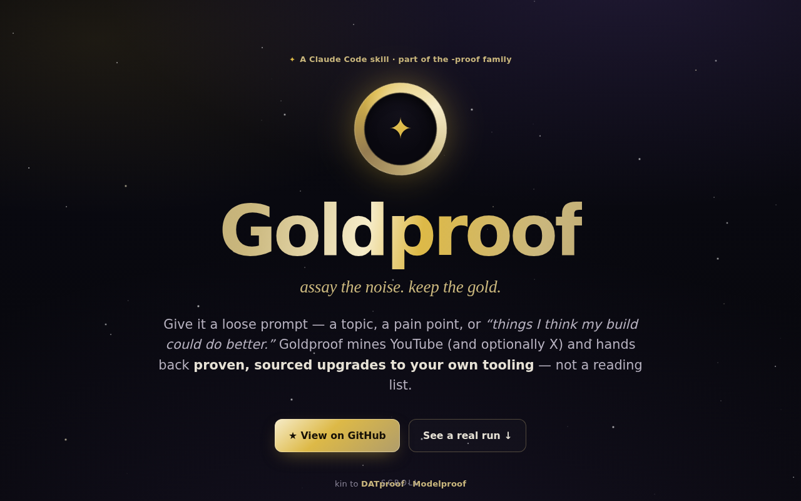

<div align="center">

# ✦ Goldproof

**Mine YouTube (and optionally X) for _proven, sourced_ upgrades to your Claude Code setup.**

Give it a loose prompt — a topic, a pain point, or _"things I think my build could do better."_
Goldproof fans out research sub-agents, distills the firehose down to a handful of **sourced,
confidence-graded findings**, and turns them into **actionable changes to your own tooling**:
things to _integrate now_, new _skills to scaffold_, and _CLAUDE.md / behavior edits_ —
proposed as diffs you approve. Dry-run by default.

`MIT` · a Claude Code Skill · part of the `-proof` family (DATproof · Modelproof)



</div>

---

## Why

Great Claude Code technique lives in creators' heads, YouTube walkthroughs, and X threads — not in
docs you can grep. Goldproof goes and gets it, then hands you **specific edits to your setup** instead
of a summary you have to act on yourself. Every claim carries a **source URL (+ timestamp)** and a
**confidence level**; anything it can't locate a source for is **dropped, not guessed**.

## What makes it different

- **Sourced or it doesn't ship.** Each finding has a resolving URL, a verbatim evidence quote, and a
  `high` / `moderate` / `low` confidence grade. No fabricated attributions — ever.
- **Actionable, not a reading list.** Findings are classified and come with the payload to adopt them:
  a command/config for `integrate-now`, a drop-in `SKILL.md` for `skill-candidate`, a `CLAUDE.md` diff
  for `behavior-change`. Every report ends with a ranked **"Do this first."**
- **Your context stays clean.** Raw transcripts never enter the main thread — see the token math below.
- **You approve every write.** Dry-run by default; `--apply` proposes each diff and waits for your yes.

## How it works

```
loose prompt
   │  1. build a search plan (3–5 queries per source, printed for you to tweak)
   ▼
discovery sub-agents ──▶ candidate videos/articles (lists only, no content)
   │  2. dedup + cap + enforce budgets (esp. the X read cap) BEFORE any paid read
   ▼
fetch+distill sub-agents ──▶ raw transcript/page stays INSIDE the sub-agent
   │                          only compact findings JSON returns (~200–400 tokens each)
   ▼
synthesis ──▶ merge · corroborate · classify · rank
   ▼
report.md + findings.json  ──(--apply)──▶ per-diff approval ──▶ writes
```

**The token math (why sub-agents):** one 30–60 min transcript ≈ 6k–15k tokens; fifteen sources ≈
90k–225k tokens of raw text. Pulling that into the main thread buries the signal and blows the window.
One fetch sub-agent per source ingests the raw tokens and returns a few hundred of structured findings —
**~30–50× compression on the raw layer.** Your main context holds the synthesis, not the ore.
(You still pay to read the ore _somewhere_; the win is context + parallel wall-clock. Source counts are
capped so total cost stays bounded.)

## Install

Goldproof is a Claude Code skill — drop it in your skills directory:

```bash
git clone https://github.com/lucascashwell3-ai/goldproof.git ~/.claude/skills/goldproof
# Local (residential) transcript backend:
pip install youtube-transcript-api
```

Then in Claude Code:

```
/goldproof make my Claude Code sub-agents more token-efficient
/goldproof best web-design & UI component libraries to de-stale my sites
/goldproof "AI agent eval techniques" --include-x --apply
```

It also activates automatically when you ask things like _"what am I missing on &lt;topic&gt;"_ or
_"research &lt;topic&gt; and tell me what to change."_

## Usage & flags

| Flag | Default | Meaning |
|---|---|---|
| `--include-x` | off | Also read X/Twitter. Needs `GOLDPROOF_X_API_KEY`, else skipped silently. |
| `--max-x-reads N` | 200 | Hard cap on X posts read this run. The reader refuses to exceed it. |
| `--backend local\|hosted` | `local` | Transcript backend (see caveat below). |
| `--apply` | off | Propose diffs and write approved ones. Omitted = dry-run. |
| `--out DIR` | `runs/<date>-<slug>/` | Where `report.md` + `findings.json` land. |

Configuration lives in env vars — see [`.env.example`](.env.example).

## ⚠️ Two caveats, stated plainly

**1. The local backend won't work from the cloud.** `youtube-transcript-api` works great from a
**residential** IP, but YouTube blocks datacenter IPs (AWS / GCP / Azure) — often within hours. So:

- **Personal use on your laptop → `local`** (free, no key).
- **Cloud / CI / any routine automated run → `hosted`** (Supadata or youtube-transcript.io; they fetch
  server-side behind their own proxies). Set `GOLDPROOF_TRANSCRIPT_BACKEND=hosted` + a key.

Goldproof detects a block and falls back (page metadata via web fetch) or skips the source — it never
fabricates a transcript.

**2. X costs money per read.** Goldproof uses a **third-party** read API (TwitterAPI.io-class),
**never the official X API** (whose cheapest read path is ~33× more and has no viable free tier). X is
**off by default**, requires `--include-x` **and** a key, and every run is bounded by a hard read cap
(`--max-x-reads`, default 200 ≈ **$0.03** at ~$0.00015/read). No key → X is skipped silently.

## Output

Each run writes a human `report.md` (optionally a themed `report.html`) and a machine-readable
`findings.json`. The full schema — Finding object, confidence rubric, classification rules, per-tag
payloads, and the "Do this first" ranking — is in
[`references/output-contract.md`](references/output-contract.md). A complete real run is in
[`examples/`](examples/) — [`report.md`](examples/ui-libraries-and-animation/report.md),
[`findings.json`](examples/ui-libraries-and-animation/findings.json), and a themed
[`report.html`](examples/ui-libraries-and-animation/report.html) produced by
`python3 scripts/render_report.py findings.json -o report.html`. A self-contained
[portfolio showcase page](portfolio/index.html) presents the whole thing.

## Safety

Dry-run by default. `--apply` shows each eligible diff and writes **only** on an explicit per-item yes,
backs up any file it edits, and refuses a write whose target no longer matches the diff. `low`-confidence
findings are never auto-applied.

## Repo layout

```
goldproof/
├── SKILL.md                     # the orchestrator (trigger + procedure + guardrails)
├── scripts/
│   ├── fetch_transcript.py      # local + hosted transcript backends, one interface
│   ├── x_read.py                # TwitterAPI.io reader with a hard read cap
│   └── render_report.py         # findings.json → themed HTML report (optional output)
├── references/
│   ├── output-contract.md       # the report schema (the differentiator)
│   ├── query-generation.md      # loose prompt → search plan
│   └── subagent-prompts.md      # fetch/distill templates (quote-or-drop)
├── examples/                    # one real end-to-end run (report.md · report.html · findings.json)
├── portfolio/index.html         # self-contained cosmic-gold showcase page
├── docs/architecture.md         # the decision record (recon + design)
└── .env.example · LICENSE
```

## Credits

Built by [Lucas Cashwell](https://github.com/lucascashwell3-ai). Transcript retrieval by
[`youtube-transcript-api`](https://github.com/jdepoix/youtube-transcript-api) (local) and
[Supadata](https://supadata.ai) / [youtube-transcript.io](https://www.youtube-transcript.io) (hosted).
X reads via [TwitterAPI.io](https://twitterapi.io). MIT licensed.
