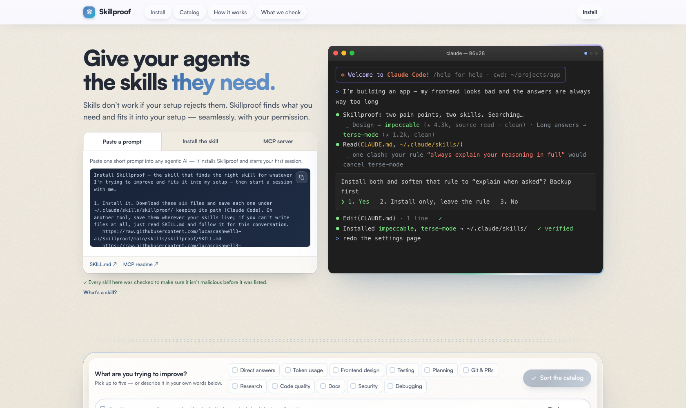

<div align="center">

# ✦ Skillproof

**Give your agents the skills they need.**

Skills don't work if your setup rejects them. Skillproof finds what you need and fits it
into the setup you already have — one short conversation, one plan, one yes.

`MIT` · a static site + a Claude Code skill + an MCP server · part of the `-proof` family (DATproof · Modelproof)



**[skillproof live →](https://lucascashwell3-ai.github.io/Skillproof/)**

</div>

---

## Three ways in

1. **Paste a prompt** — one short prompt into any agentic AI installs Skillproof and starts
   your first session. On the [site](https://lucascashwell3-ai.github.io/Skillproof/), under *Install*.
2. **The skill** (Claude Code) — six plain files downloaded to disk so you can read them.
   Nothing is piped into a shell, and it never edits your setup without showing you the plan
   and getting your yes.
3. **The MCP server** — the catalog as four read-only tools any MCP-capable agent
   (Cursor, Claude Desktop, …) can query mid-task. [`mcp/`](mcp/)

```bash
for f in SKILL.md references/consent.md references/conflict-patterns.md references/install-paths.md references/finding.md references/security.md; do curl -fsSL --create-dirs https://raw.githubusercontent.com/lucascashwell3-ai/Skillproof/main/skills/skillproof/$f -o ~/.claude/skills/skillproof/$f; done
```

## The skill — the whole job is one conversation

Tell it what hurts ("my sites all look the same", "my setup is a mess", "find me a skill
for X"). It plays five beats:

1. **Readback** — one line confirming what you actually want. You say yes.
2. **Find** — silently checks what you already have installed, then the Skillproof catalog,
   then live GitHub.
3. **Fit-check** — reads your CLAUDE.md, rules, and installed skills; finds what the new
   skill would clash with or duplicate.
4. **One plan, one yes** — everything it wants to do, as one numbered plan. Backups first.
5. **Execute + confirm** — installs, verifies it triggers, tells you how to undo it.

It integrates into the setup you have — it doesn't pile files on top of it.

## The catalog — 90+ skills, refreshed daily

- **One bar for listing: every skill was checked to make sure it isn't malicious.** Full
  source read before it's listed. That's the promise — no grades, no rankings; skills are
  provided as-is by their authors.
- **It maintains itself.** A daily GitHub Action ([`feeder.yml`](.github/workflows/feeder.yml))
  finds new skills from trusted creators and community sources, re-scans entries when their
  code changes, and re-checks quarantined ones — only a malice flag in runnable code removes
  an entry.
- **The site** ([`docs/`](docs/)) — pick up to five frustrations (or type your own words) and
  get matching skills, or sort the whole catalog. Data: [`docs/data/skills.json`](docs/data/skills.json).

## Repo layout

```
Skillproof/
├── docs/                   # the site (GitHub Pages) — matcher, catalog, install
├── skills/skillproof/      # the Claude Code skill (SKILL.md + references/)
├── mcp/                    # the MCP server (read-only catalog tools)
├── automation/             # the feeder job — owner docs
├── .github/workflows/      # feeder.yml (daily catalog refresh)
└── scripts/                # feeder + scan pipeline and its tests
```

## Credits

Built by [Lucas Cashwell](https://github.com/lucascashwell3-ai). MIT licensed. Skills in
the catalog belong to their authors — Skillproof indexes and checks them, nothing more.
