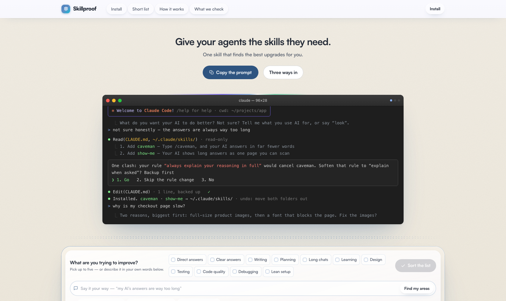

<div align="center">

# ✦ Skillproof

**Make AI easier with Skillproof.**

Skills don't work if your setup rejects them. Skillproof finds what you need and fits it
into the setup you already have — one short conversation, one plan, one yes.

`MIT` · a static site + a Claude Code skill + an MCP server · part of the `-proof` family (DATproof · Modelproof)



**[skillproof live →](https://lucascashwell3-ai.github.io/Skillproof/)**

</div>

---

## Three ways in

1. **Paste a prompt** — one short prompt into any AI app starts your first session. Nothing is
   saved until you say yes to the plan, Skillproof itself included. On the [site](https://lucascashwell3-ai.github.io/Skillproof/), under *Install*.
2. **The skill** — six plain files downloaded to disk so you can read them (Claude Code
   shown; any app with a skills folder works the same way).
   Nothing is piped into a shell, and it never edits your setup without showing you the plan
   and getting your yes.
3. **The MCP server** — the catalog as four read-only tools any MCP-capable agent
   (Cursor, Claude Desktop, …) can query mid-task. [`mcp/`](mcp/)

```bash
for f in SKILL.md references/consent.md references/conflict-patterns.md references/install-paths.md references/finding.md references/security.md; do curl -fsSL --create-dirs https://raw.githubusercontent.com/lucascashwell3-ai/Skillproof/main/skills/skillproof/$f -o ~/.claude/skills/skillproof/$f; done
```

On Windows (PowerShell):

```powershell
foreach ($f in 'SKILL.md','references/consent.md','references/conflict-patterns.md','references/install-paths.md','references/finding.md','references/security.md') { $p = "$HOME\.claude\skills\skillproof\$f"; New-Item -ItemType Directory -Force (Split-Path $p) | Out-Null; curl.exe -fsSL "https://raw.githubusercontent.com/lucascashwell3-ai/Skillproof/main/skills/skillproof/$f" -o $p }
```

## The skill — one short conversation it leads

You don't need to know what to ask for. It opens with one question — *what do you want your AI
to do better?* — and "not sure" is a fine answer: it reads your setup (read-only) or asks one
multiple-choice question, then offers a few proven skills that fit. Five beats:

1. **Open** — one short question. Nothing to say? It works it out and still brings a plan.
2. **Find** — silently checks what you already have, then the Skillproof short list.
3. **Plan** — one short numbered plan. Five lines or fewer stays in chat; longer becomes one
   simple page.
4. **One yes** — nothing changes before it. Backups first for anything you already have.
5. **Install** — one clear line per skill, saying what it does or how to call it, then the undo.

It fits into the setup you have — no twins, no pile — and works in every app that keeps
skills: Claude Code, the Claude app (free plan too), Codex, Cursor, Gemini, Copilot, and
ChatGPT Business/Enterprise/Edu.

## The short list — proven single skills

- **One bar for every entry:** real use (install counts or stars on the skill's own repo) or a
  builder with a record, useful to a normal AI user, and a malice scan of the skill's own
  files. No grades, no rankings; skills are provided as-is by their authors.
- **Single skills, never whole packs.** Each entry links to the skill's own folder on GitHub so
  you can read the source before you install it.
- **It maintains itself.** A daily GitHub Action ([`feeder.yml`](.github/workflows/feeder.yml))
  follows proven authors skill by skill, reads install counts, re-scans entries when their code
  changes, and pulls anything that turns malicious.
- **The site** ([`docs/`](docs/)) — pick a frustration (or type your own words) and get matching
  skills, or browse the list. Data: [`docs/data/skills.json`](docs/data/skills.json).

## Repo layout

```
Skillproof/
├── docs/                   # the site (GitHub Pages) — matcher, short list, install
├── skills/skillproof/      # the skill (SKILL.md + references/)
├── mcp/                    # the MCP server (read-only short-list tools)
├── automation/             # the feeder job — owner docs
├── .github/workflows/      # feeder.yml (daily short-list refresh)
└── scripts/                # feeder + scan pipeline and its tests
```

## Credits

Built by [Lucas Cashwell](https://github.com/lucascashwell3-ai). MIT licensed. Skills on
the list belong to their authors — Skillproof indexes and checks them, nothing more.
